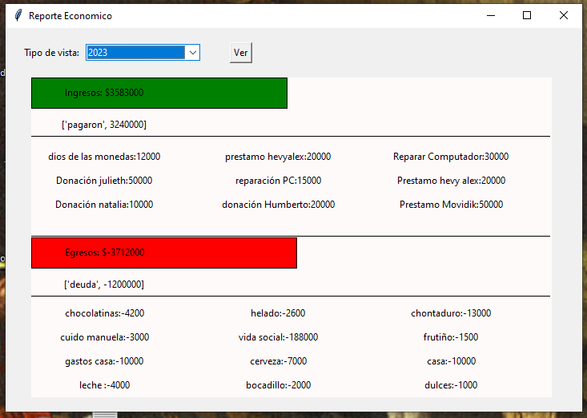

<h1 align="center"> FelipedelosH </h1>
 
<h4>Diario personal de Andrés felipe Hernández</h4>

:construction: Proyecto en construcción :construction:
  
Este es mi diario personal, aquí están escritos mis más intimos recuerdos, mis sueños (Zzz), conteo de lo que siento cada día, lo que vivo con los demás, mi situación economica, mis miedos y adiciones, mi asistente CHATBOT personal (FEMPUTADORA).
  
Nota 01: se advierte que lo escrito aquí no tiene censura alguna.
 
Nota 02: se advierte que el codigo está hecho por un niño que apenas estaba aprendiendo a programar hasta el día de hoy un adulto que apenas se está adentrando al mundo del codigo.

## :hammer:Funcionalidades del proyecto

- `Funcionalidad 1`: Guardar/Cargar paginas de diario. 
- `Funcionalidad 1b`: Guardar/Cargar paginas de diario de sueños. 
- `Funcionalidad 1c`: Guardar/Cargar relaciones interpersonales. 
- `Funcionalidad 2`: Guardar/Cargar movimientos económicos(ingresos/egresos). 
- `Funcionalidad 2a`: Graficar movimientos económicos. 

- `Funcionalidad 3`: Asistente CHATBOT. 

- `Funcionalidad 4`: Guardar estados emocionales. 

- `Funcionalidad 4a`: Graficar conteo de estados emocionales. 

- `Funcionalidad 4b`: Guardar actividades realizadas durante el día (Como inviertes tu tiempo). 

- `Funcionalidad 4c`: Vista de horario semanal. 

- `Funcionalidad 4d`: Vista de horario semanal (Ley de los grandes números - Bernoulli). 

- `Funcionalidad 4e`: Inversión de tiempo anual. 

- `Funcionalidad 4f`: Registo de consumo de sustancias Psicoactivas. 
- `Funcionalidad 5`: Alarmas. 

## :play_or_pause_button:Ejecutar el proyecto

Este proyecto esta totalmente escrito en python, no descargue ninguna libreria. para ejecutarlo basta con hacer doble click sobre el archivo main.py y esperar a que el programa cargue.

## :hammer_and_wrench:Tecnologías.

- :snake: Python
- Tkinter
- OS
- math
- winsound
- random
- time
- datetime

## :warning:Advertencia

- Este proyecto fue escrito en windows y no funciona otros sistemas operativos. debido al modulo "winsound".

## Autor

| [ Andrés Felipe Hernánez](https://github.com/felipedelosh)|
| :---: |